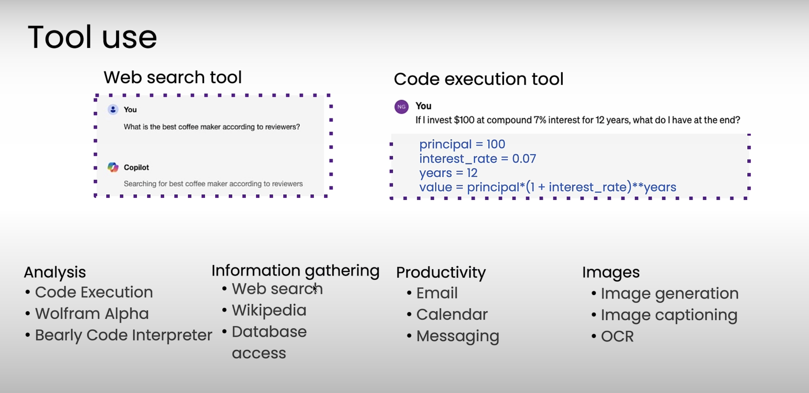

# Degrees of Automation

- Less Autonomous : promt:"Write an Essay" -> LLM -> hardcoded web search -> LLM (write essay) -> Output
- More Autonous: promt:"Write an Essay" -> LLM -> LLM decides which tools to use -> LLM -> web fetch/ convert to pdf -> output

# Benifits of Agentic AI Workflow
 - Parallel Processing
 - Non Agentic Models with Agentic workflows much better than Base Models
 - Modular - can add or update tools or even swap out models

 # Applications
 - Invoice processing : PDF -> extract text -> LLM (tools update DB) -> update DB -> Record Updated
 - Responding to Customer Email
 - Customer Service Agent
 

 # For what Tasks they can be used for?
 -Easier
  - Clear Step by Step process
  - Standard Procedures to follow
  - Text assets only

-Harder
  - Step Not known ahead of time
  - Plan/Solve as you go
  - Multimodal (sound, vision, ...)

# Task Decomposition
- Iteratively breakdown workflow each step to get a better output

|Building Block | Example   |  Use Cases                                                 |
|---------------|-----------|------------------------------------------------------------|
|Models         | LLM       |  Text Generation, Tool use,Info Extraction                 |
|               | AI Model  |  PDF-to-text, text-to-speech, image analysis               |
|---------------|-----------|------------------------------------------------------------|
|Tools          | API       |  web search, get real-time-data, send email, check calendar|
|---------------|-----------|------------------------------------------------------------|
|               | Info get  |  DB, RAG                                                   |
|---------------|-----------|------------------------------------------------------------|
|               | Code Exec |  Basic Calculator, data analysis                           |

# Evals

- Evaluate by manually spotting errors 
- Use code to check the responses to add evaluations
- Use LLM to rate the input from 1 to 5, 5 being the best
- End to end && Component Evals
- Examine Traces to perform error analysis

# Design Patterns

- Reflection => Coder Agent + Critic Agent
- Tool use => Web Search Tool, Code Execution Tool
- Planning => Agent decide what tools to use with what sequence to get the best result
- Multi-agent Collaboration => 

# Why not direct generation?

- Examples using reflection => HTML, Generate a sequence steps, Generate domain names

